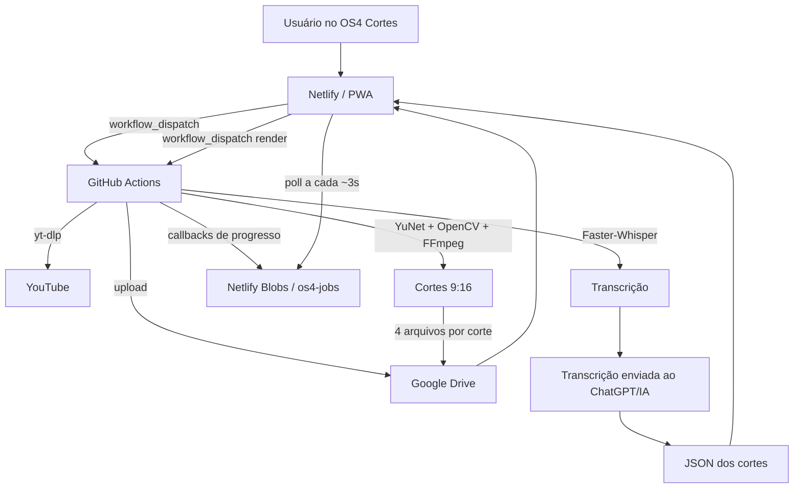

# OS4 CORTES — HANDOFF TÉCNICO COMPLETO

> **Estado deste documento:** 13/09/2026  
> **Projeto:** OS4 Cortes  
> **Repositório:** `Lucascristao/os4cortes`  
> **Branch principal:** `main`  
> **Produção:** `https://os4cortes.netlify.app`  
> **Objetivo deste arquivo:** permitir que outra IA/engenheiro entenda o sistema, sua arquitetura, seu fluxo, decisões já tomadas, partes validadas e cuidados para continuar o desenvolvimento sem redescobrir o projeto.

---

## 1. O QUE É O OS4 CORTES

O **OS4 Cortes** é um sistema pessoal para transformar vídeos longos do YouTube em vários cortes verticais **9:16**, preparados para Reels, Shorts e TikTok.

O sistema foi desenhado para evitar infraestrutura cara e manter o processamento pesado fora do navegador:

- **Netlify** hospeda a interface/PWA e as funções de backend leves.
- **GitHub Actions** executa o processamento pesado de vídeo, transcrição, tracking, legendas e renderização.
- **Google Drive** guarda permanentemente o vídeo-base, transcrição e cortes produzidos.
- **Não há Supabase** nesta versão.
- O usuário usa uma IA externa (normalmente ChatGPT) para fazer a **seleção editorial dos melhores trechos** com base na transcrição.

A arquitetura atual já foi validada de ponta a ponta em um processamento real com **15 cortes**, concluído com sucesso.

---

## 2. ESTADO ATUAL DO PRODUTO

### O que já funciona

1. Login com Google.
2. Sessão persistente no navegador.
3. Conexão inicial com Google Drive.
4. Conexão do painel com GitHub Actions por token Fine-grained.
5. Entrada de URL do YouTube.
6. Download do vídeo no GitHub Actions.
7. Transcrição com Faster-Whisper.
8. Transcrição legível para enviar a uma IA.
9. Transcrição estruturada com timestamps de palavras.
10. Salvamento do vídeo-base e transcrições no Google Drive.
11. Importação do pacote editorial em JSON.
12. Edição manual dos cortes antes da geração.
13. Tracking automático de rosto para reenquadramento 9:16.
14. Renderização de MP4 sem legenda.
15. Geração de SRT.
16. Geração de vídeo com legenda queimada.
17. Geração de TXT com título, legenda da postagem e hashtags.
18. Upload de cada corte ao Drive **antes de iniciar o próximo corte**.
19. Progresso em tempo real no painel.
20. Retomada visual de job após recarregar a página enquanto ainda está processando.
21. Persistência do último trabalho concluído no `localStorage`.
22. Download direto do **vídeo com legenda** na tela de resultados.
23. PWA instalável.
24. CI automático.
25. Limpeza automática de artifacts e histórico antigo do GitHub Actions.

### O que NÃO existe atualmente

- Upload de arquivo de vídeo pelo navegador ainda não está implementado; o fluxo atual usa **URL do YouTube**.
- A IA não escolhe os cortes automaticamente dentro do sistema. A transcrição é exportada e analisada por uma IA externa.
- Não existe Supabase, banco SQL ou sistema de usuários tradicional.
- Não existe cobrança/plano comercial nesta versão.
- O processamento não é paralelo: os cortes são feitos **sequencialmente de propósito**.

---

## 3. PRINCÍPIO CENTRAL DA ARQUITETURA

O navegador **não renderiza vídeos**.

O front apenas:

- autentica o usuário;
- recebe comandos;
- inicia workflows;
- acompanha o status;
- exibe a transcrição;
- recebe/importa o pacote editorial;
- mostra os resultados.

O GitHub Actions faz o trabalho pesado.

O Google Drive é a camada de armazenamento persistente.

Fluxo resumido:



---

# 4. ESTRUTURA PRINCIPAL DO REPOSITÓRIO

```text
os4cortes/
├── .github/
│   └── workflows/
│       ├── ci.yml
│       ├── limpeza-actions.yml
│       ├── poc-corte.yml
│       ├── renderizar.yml
│       └── transcrever.yml
│
├── netlify/
│   └── functions/
│       ├── _shared/
│       ├── auth-logout.js
│       ├── auth-session.js
│       ├── drive-setup.js
│       ├── github-setup.mts
│       ├── google-auth-callback.js
│       ├── google-auth-callback.mts
│       ├── google-auth-start.js
│       ├── google-auth-start.mts
│       ├── workflow-progress.mts
│       ├── workflow-start.mts
│       └── workflow-status.mts
│
├── processor/
│   ├── __init__.py
│   ├── captions.py
│   ├── download.py
│   ├── drive.py
│   ├── poc.py
│   ├── prepare.py
│   ├── progress.py
│   ├── render_batch.py
│   ├── tracking.py
│   ├── transcribe.py
│   └── utils.py
│
├── tests/
├── web/
│   ├── index.html
│   ├── app.js
│   ├── enhancements.js
│   ├── style.css
│   ├── manifest.webmanifest
│   └── sw.js
│
├── netlify.toml
├── package.json
├── requirements.txt
├── requirements-render.txt
└── README.md
```

---

# 5. FRONT-END / PWA

## 5.1 Arquivos principais

### `web/index.html`

Estrutura visual principal.

Contém:

- tela de login;
- cabeçalho com usuário e botão **Sair**;
- status da conexão com Drive/GitHub;
- campo de URL do YouTube;
- cards de status: Vídeo, Transcrição, Cortes;
- barra geral de progresso;
- área da transcrição;
- área para importar pacote editorial;
- editor dos cortes;
- botão **Gerar todos os cortes**;
- resultados finais.

Carrega:

```html
<script src="/app.js" defer></script>
<script src="/enhancements.js" defer></script>
```

### `web/app.js`

É a lógica principal do painel.

Responsabilidades:

- verificar sessão;
- verificar setup do Drive;
- verificar conexão GitHub;
- iniciar transcrição;
- iniciar renderização;
- polling de progresso;
- restaurar job em andamento;
- mostrar transcrição;
- importar pacote JSON;
- criar editor dos cortes;
- mostrar resultados.

### `web/enhancements.js`

Camada adicionada posteriormente para melhorias de UX sem alterar o motor que já estava validado.

Hoje cuida de:

- aceitar pacotes com `CORTES = [...]` além de JSON puro;
- remover blocos/fences Markdown de código (por exemplo, blocos marcados como JSON);
- barra de progresso específica da geração de cortes;
- download direto do vídeo com legenda;
- persistência do pacote editorial;
- persistência das edições dos cortes;
- persistência dos resultados finais;
- restauração do último trabalho após refresh;
- limpeza do estado local quando começa um novo vídeo;
- limpeza do estado local ao clicar em **Sair**.

> **Nota de manutenção:** no futuro pode ser interessante incorporar essas melhorias diretamente ao `app.js`, mas não fazer uma refatoração grande sem testes porque o fluxo atual já foi validado.

---

# 6. PERSISTÊNCIA NO NAVEGADOR

O sistema usa `localStorage` para manter o trabalho atual/último trabalho.

Chaves importantes:

```text
os4_transcription_session
os4_current_job
os4_editor_package
os4_editor_cuts
os4_last_results_view
```

## Comportamento desejado e implementado

### Recarregar a página

Mantém:

- transcrição;
- pacote editorial;
- campos editados;
- último resultado;
- links dos cortes.

### Fechar e abrir o navegador

O último trabalho continua disponível enquanto o navegador mantiver o `localStorage`.

### Job ainda rodando

`os4_current_job` permite retomar o acompanhamento do processamento após refresh.

### Começar um vídeo novo

O trabalho anterior é removido da interface/localStorage.

Os arquivos antigos no Drive **não são apagados**.

### Clicar em Sair

Limpa:

- sessão local do trabalho;
- pacote;
- cortes;
- resultados;
- job local.

O Drive **não é apagado**.

### Se o navegador limpar os dados do site

A interface perde o estado local, mas os arquivos permanecem no Google Drive.

---

# 7. AUTENTICAÇÃO GOOGLE

O acesso ao painel usa Google OAuth.

Principais endpoints:

```text
/.netlify/functions/google-auth-start
/.netlify/functions/google-auth-callback
/.netlify/functions/auth-session
/.netlify/functions/auth-logout
```

O cookie da sessão é:

```text
os4_session
```

Características:

- `HttpOnly`
- `Secure`
- `SameSite=Lax`
- assinado por HMAC SHA-256;
- sessão deslizante/renovável.

## Duração

A sessão atualmente usa até **400 dias**, sendo renovada sempre que `auth-session` valida a sessão.

Objetivo funcional:

> O usuário só deve ser deslogado ao clicar em **Sair**, salvo se o navegador apagar cookies/dados do site.

Essa mudança foi feita porque anteriormente a sessão expirava automaticamente em 7 dias.

---

# 8. GOOGLE DRIVE

O Drive é o armazenamento permanente do sistema.

## Scope

O processador utiliza:

```text
https://www.googleapis.com/auth/drive.file
```

## Credenciais esperadas no GitHub Actions

```text
GOOGLE_CLIENT_ID
GOOGLE_CLIENT_SECRET
GOOGLE_REFRESH_TOKEN
GOOGLE_DRIVE_FOLDER_ID
```

Não colocar valores reais em código ou documentação pública.

## Estrutura por sessão

Ao transcrever um vídeo, é criada uma pasta semelhante a:

```text
OS4 Cortes/
└── sessao_<request-id>/
    ├── video_base.mp4
    ├── transcricao.json
    ├── transcricao_para_chatgpt.txt
    ├── corte_01_....mp4
    ├── corte_01_...._legenda.mp4
    ├── corte_01_....srt
    ├── corte_01_...._post.txt
    ├── corte_02_....mp4
    └── ...
```

## Regra fundamental

Cada corte é:

1. renderizado;
2. legendado;
3. arquivos auxiliares criados;
4. **todos os arquivos enviados ao Drive**;
5. marcado como concluído;
6. somente então o próximo corte começa.

Isso foi proposital para evitar perder o lote inteiro em uma falha tardia.

---

# 9. CONEXÃO COM GITHUB ACTIONS

A interface não possui token hardcoded.

O usuário conecta um **GitHub Fine-grained Personal Access Token**.

Permissão esperada:

```text
Repositório: Lucascristao/os4cortes
Actions: Read and write
```

O endpoint é:

```text
/.netlify/functions/github-setup
```

## Armazenamento do token

O token é salvo em Netlify Blobs no store:

```text
os4-config
```

Chave por usuário:

```text
github:<sha256(email)>
```

O token é criptografado com:

```text
AES-256-GCM
```

A chave deriva de `OS4_SESSION_SECRET`.

O token nunca deve ser devolvido ao navegador após ser salvo.

---

# 10. NETLIFY BLOBS

O projeto usa Netlify Blobs para estado leve do backend.

## Stores

### `os4-config`

Guarda a configuração GitHub do usuário.

### `os4-jobs`

Guarda estado dos jobs de transcrição/renderização.

Um job possui aproximadamente:

```json
{
  "kind": "render",
  "status": "running",
  "stage": "tracking",
  "detail": "Gerando corte 2/15: ...",
  "percent": 15.7,
  "stagePercent": null,
  "current": null,
  "total": null,
  "cut": 2,
  "totalCuts": 15,
  "result": null,
  "error": null,
  "createdAt": "...",
  "updatedAt": "..."
}
```

O job também contém internamente:

- `ownerHash` para garantir que somente o usuário correto consulte;
- `callbackHash` para autenticar atualizações enviadas pelo GitHub Actions.

---

# 11. FLUXO 1 — TRANSCRIÇÃO COMPLETA

## Passo 1 — usuário informa URL

Na interface:

```text
URL do vídeo
https://youtube.com/watch?v=...
```

O botão chama:

```text
POST /.netlify/functions/workflow-start
```

Payload simplificado:

```json
{
  "kind": "transcribe",
  "videoUrl": "https://youtube.com/watch?v=..."
}
```

## Passo 2 — Netlify cria job

`workflow-start.mts`:

1. valida sessão;
2. valida URL;
3. lê token GitHub criptografado;
4. cria `requestId` UUID;
5. cria registro em `os4-jobs`;
6. dispara `transcrever.yml` por `workflow_dispatch`.

## Passo 3 — GitHub Actions prepara ambiente

Workflow:

```text
.github/workflows/transcrever.yml
```

Runtime:

```text
ubuntu-latest
Python 3.11
timeout: 180 minutos
```

Etapas:

1. checkout;
2. Python 3.11;
3. cache do Whisper;
4. instalação de FFmpeg/fontconfig;
5. instalação do Deno;
6. dependências Python;
7. inicialização do PO Token provider do YouTube;
8. cookies opcionais do YouTube;
9. download/transcrição/upload ao Drive;
10. artifact temporário da transcrição por 1 dia.

## Passo 4 — download do YouTube

Tecnologias:

```text
yt-dlp
bgutil-ytdlp-pot-provider 2.0.0
PO Token local
cookies opcionais como fallback
```

Há suporte a secret opcional:

```text
YOUTUBE_COOKIES_B64
```

O vídeo é limitado a no máximo aproximadamente 1080p no fluxo atual.

## Passo 5 — extração do áudio

FFmpeg converte para:

```text
mono
16 kHz
PCM s16le
```

Arquivo temporário:

```text
audio.wav
```

## Passo 6 — Faster-Whisper

Configuração atual padrão:

```text
modelo: small
idioma: pt
device: cpu
compute_type: int8
vad_filter: true
word_timestamps: true
beam_size: 5
```

Saídas:

### `transcricao.json`

Contém segmentos e timestamps por palavra:

```json
[
  {
    "start": 120.9,
    "end": 126.4,
    "text": "Texto falado...",
    "words": [
      {
        "start": 120.9,
        "end": 121.2,
        "word": "Texto"
      }
    ]
  }
]
```

### `transcricao_para_chatgpt.txt`

Formato legível:

```text
[02:00.9 → 02:06.4] Texto falado...
```

## Passo 7 — salvar no Drive

A função `processor.prepare` cria a pasta da sessão e salva:

```text
video_base.mp4
transcricao.json
transcricao_para_chatgpt.txt
```

O resultado devolvido ao front contém:

```json
{
  "requestId": "...",
  "folderId": "...",
  "videoFileId": "...",
  "transcriptJsonFileId": "...",
  "transcriptTxtFileId": "...",
  "duration": 2176.3,
  "transcript": "...",
  "driveFolderUrl": "https://drive.google.com/drive/folders/..."
}
```

---

# 12. FLUXO 2 — SELEÇÃO EDITORIAL DOS CORTES

Após a transcrição, o sistema mostra o TXT.

O usuário normalmente:

1. copia ou baixa `transcricao_para_chatgpt.txt`;
2. envia para o ChatGPT/IA;
3. pede seleção dos melhores cortes;
4. recebe JSON;
5. cola o JSON no OS4 Cortes;
6. revisa tudo antes de gerar.

## Critério editorial esperado

A IA deve procurar trechos que:

- funcionem isoladamente;
- tenham começo compreensível;
- não iniciem no meio de uma frase;
- não terminem no meio de uma ideia;
- tenham gancho;
- tragam uma ideia, história, opinião ou conclusão clara;
- evitem repetição excessiva entre cortes.

---

# 13. FORMATO DO PACOTE EDITORIAL

Formato recomendado:

```json
[
  {
    "titulo": "Você não tem uma empresa, você tem um emprego",
    "inicio": "03:21.1",
    "fim": "04:30.4",
    "legenda_post": "Se o negócio para de faturar quando você para de trabalhar...",
    "hashtags": "#empreendedorismo #negocios #empresa"
  }
]
```

Também aceita:

```json
{
  "cortes": [
    {
      "titulo": "...",
      "inicio": "03:21.1",
      "fim": "04:30.4"
    }
  ]
}
```

A interface agora também tolera respostas de IA como:

```python
CORTES = [
    {...}
]
```

ou:

```javascript
const CORTES = [
  {...}
];
```

ou conteúdo dentro de fences Markdown.

## Limites

Atualmente:

```text
mínimo: 1 corte
máximo: 30 cortes por processamento
```

O backend também limita o tamanho de `cuts_json` a aproximadamente **60.000 caracteres**.

## Formatos de tempo

Exemplos válidos:

```text
75
01:15
01:15.5
00:01:15.500
```

O `fim` deve obrigatoriamente ser maior que o `inicio`.

---

# 14. EDITOR DE CORTES

Depois de importar, cada corte vira um card editável.

Campos:

```text
Título
Início
Fim
Legenda da postagem
Hashtags
```

Existe botão para copiar legenda/post e botão de lixeira para excluir cortes indesejados antes do processamento. Ao excluir, a numeração é reajustada automaticamente e sincronizada com o armazenamento local.

As alterações são persistidas no navegador.

---

# 15. FLUXO 3 — GERAÇÃO DOS CORTES

Ao clicar em:

```text
Gerar todos os cortes
```

O front chama:

```text
POST /.netlify/functions/workflow-start
```

Payload simplificado:

```json
{
  "kind": "render",
  "folderId": "...",
  "videoFileId": "...",
  "transcriptJsonFileId": "...",
  "cuts": [
    {
      "titulo": "...",
      "inicio": "03:21.1",
      "fim": "04:30.4",
      "legenda_post": "...",
      "hashtags": "..."
    }
  ]
}
```

O backend dispara:

```text
.github/workflows/renderizar.yml
```

Runtime:

```text
ubuntu-latest
Python 3.11
timeout: 180 minutos
```

Entrada enviada ao workflow:

```text
request_id
folder_id
video_file_id
transcript_json_file_id
cuts_json
callback_url
```

---

# 16. PROCESSAMENTO DE CADA CORTE

Arquivo principal:

```text
processor/render_batch.py
```

O processamento é **sequencial**.

Pseudo-fluxo:

```python
for corte in cortes:
    gerar tracking 9:16
    gerar SRT
    queimar legenda
    gerar TXT de postagem
    fazer upload dos 4 arquivos
    confirmar corte concluído
    apagar temporários locais
```

## Arquivos finais de cada corte

Quatro arquivos:

```text
1. vídeo sem legenda (.mp4)
2. vídeo com legenda (_legenda.mp4)
3. legenda (.srt)
4. texto da postagem (_post.txt)
```

A interface oferece:

```text
Baixar vídeo com legenda
Vídeo sem legenda
SRT
Texto da postagem
```

O primeiro usa link de download direto.

---

# 17. TRACKING / REENQUADRAMENTO 9:16

Arquivo:

```text
processor/tracking.py
```

Tecnologias:

```text
OpenCV
YuNet Face Detector
FFmpeg
```

Modelo usado:

```text
face_detection_yunet_2026may.onnx
```

O modelo é obtido do OpenCV Zoo quando necessário.

## Processo

1. extrai apenas o trecho do corte;
2. cria proxy H.264 em altura 720p;
3. abre com OpenCV;
4. detecta rosto periodicamente;
5. escolhe o rosto de maior relevância por área × confiança;
6. suaviza a posição horizontal;
7. recorta janela 9:16;
8. redimensiona para 1080×1920;
9. renderiza vídeo sem áudio;
10. recoloca o áudio do vídeo original;
11. gera MP4 final com `faststart`.

## Parâmetros atuais relevantes

```text
saída: 1080 x 1920
detecção: a cada 3 frames
score_threshold: 0.70
nms_threshold: 0.30
alpha de suavização: 0.18
proxy: 720p
codec: libx264
```

> O tracking atual privilegia um rosto principal. Em cenas com múltiplos interlocutores a qualidade deve ser avaliada visualmente antes de mudanças grandes.

---

# 18. LEGENDAS

Arquivo:

```text
processor/captions.py
```

Fonte:

```text
Archivo Black
```

É obtida do Google Fonts durante o processamento se necessário.

## Estilo atual

```text
font_name: Archivo Black
font_size: 68
margin_v: 330
outline: 4
shadow: 0
max_words: 9
max_chars: 54
pause_cut: 0.55 s
```

A legenda usa os **word timestamps** da transcrição.

Características:

- texto base branco;
- palavra ativa destacada em amarelo;
- máximo aproximado de duas linhas equilibradas;
- agrupamento por quantidade de palavras, tamanho e pausas;
- pontuação pode forçar quebra natural;
- geração de `.srt` independente;
- geração temporária `.ass` para animação palavra por palavra;
- `.ass` é removido após o MP4 legendado ser concluído.

O vídeo legendado usa:

```text
libx264
preset veryfast
CRF 18
áudio copiado
+faststart
```

---

# 19. TEXTO DE POSTAGEM

Para cada corte é criado:

```text
corte_XX_nome_post.txt
```

Conteúdo:

```text
Título

Legenda da postagem

#hashtags
```

---

# 20. SISTEMA DE PROGRESSO

O sistema possui progresso real do backend, não apenas animação visual.

Arquivo Python:

```text
processor/progress.py
```

Endpoint Netlify:

```text
/.netlify/functions/workflow-progress
```

Consulta do front:

```text
/.netlify/functions/workflow-status?id=<requestId>
```

O front consulta aproximadamente a cada:

```text
3 segundos
```

## Stages conhecidos

```text
fila
preparando
preparando_cortes
download
baixando_base
audio
carregando_whisper
transcricao
tracking
legendas
drive
cortes
concluido
erro
```

## Exemplo de log do processador

```text
OS4_PROGRESS|stage=tracking|overall=15.7|cut=2|total_cuts=15|detail=Gerando corte 2/15: ...
```

Isso alimenta:

- barra geral;
- percentual;
- texto da etapa;
- detalhe;
- `Corte X de Y`;
- barra específica perto do botão de geração.

---

# 21. AUTENTICAÇÃO DO CALLBACK DE PROGRESSO

O GitHub Actions não pode atualizar jobs arbitrariamente.

Um token de callback é derivado usando HMAC do `requestId` com o segredo compartilhado.

Conceito:

```text
HMAC-SHA256(GOOGLE_CLIENT_SECRET, "os4-progress:<request-id>")
```

No Netlify é armazenado apenas o hash esperado do token do callback.

`workflow-progress.mts` rejeita callback inválido.

Também existe proteção para impedir que um callback atrasado sobrescreva um job já terminal:

```text
completed
error
```

---

# 22. DOWNLOAD DIRETO DOS RESULTADOS

Na tela final, o botão principal é:

```text
Baixar vídeo com legenda
```

Ele não deve abrir o preview normal do Google Drive.

O front extrai o file ID do Drive e transforma em URL de download usando:

```text
https://drive.usercontent.google.com/download?id=<FILE_ID>&export=download&confirm=t
```

Os outros links continuam podendo abrir no Drive:

```text
Vídeo sem legenda
SRT
Texto da postagem
```

---

# 23. NETLIFY

## Site

```text
os4cortes.netlify.app
```

## Publicação

`netlify.toml` define:

```toml
[build]
  publish = "web"

[functions]
  directory = "netlify/functions"
  node_bundler = "esbuild"
```

O deploy está ligado à branch `main`.

## Segurança HTTP

Há headers para:

```text
X-Robots-Tag: noindex
X-Content-Type-Options: nosniff
Referrer-Policy: no-referrer
X-Frame-Options: DENY
Permissions-Policy restritiva
Content-Security-Policy
```

O projeto não deve ser indexado por buscadores.

---

# 24. PWA E SERVICE WORKER

Arquivo:

```text
web/sw.js
```

Cache atual no momento deste handoff:

```text
os4-cortes-v7
```

App shell cacheado:

```text
/
/index.html
/style.css
/app.js
/enhancements.js
/manifest.webmanifest
```

O service worker usa estratégia **network first**, com cache como fallback.

Nunca cachear:

- respostas de autenticação;
- tokens;
- jobs;
- resultados privados de API.

Ao mudar arquivos front-end, aumentar a versão do cache quando necessário para evitar cliente preso em versão antiga.

---

# 25. DEPENDÊNCIAS PYTHON

`requirements.txt` contém, entre outras:

```text
yt-dlp[default]
bgutil-ytdlp-pot-provider==2.0.0
faster-whisper
opencv-python-headless
numpy
google-api-python-client
google-auth
google-auth-httplib2
google-auth-oauthlib
```

O workflow de render usa `requirements-render.txt`, menor, para reduzir tempo/custo quando Whisper/yt-dlp não são necessários.

---

# 26. YOUTUBE / PO TOKEN

O download do YouTube já precisou de tratamento específico devido às proteções atuais do YouTube.

O workflow de transcrição:

1. instala Deno;
2. clona `Brainicism/bgutil-ytdlp-pot-provider` na versão `2.0.0`;
3. compila o servidor;
4. inicia o provider em `127.0.0.1:4416`;
5. verifica `/ping`;
6. usa PO Token no yt-dlp;
7. pode usar cookies como fallback.

**Não simplificar/remover essa parte sem testar um download real do YouTube.**

---

# 27. GITHUB ACTIONS

## `transcrever.yml`

Responsável por:

```text
YouTube → vídeo → áudio → Whisper → Drive
```

Timeout:

```text
180 minutos
```

Artifact da transcrição:

```text
retention-days: 1
```

## `renderizar.yml`

Responsável por:

```text
Drive → vídeo-base/transcrição → cortes → Drive
```

Timeout:

```text
180 minutos
```

## `ci.yml`

Roda em:

```text
push em main
pull_request
workflow_dispatch
```

Valida:

- `npm test`;
- sintaxe de `web/app.js`;
- sintaxe de `web/sw.js`;
- `compileall` dos módulos Python;
- existência dos arquivos PWA;
- validade do manifest.

> Como `enhancements.js` ganhou responsabilidade importante, é recomendável futuramente incluí-lo explicitamente em `node --check` no CI.

## `limpeza-actions.yml`

Executa diariamente:

```text
cron: 17 4 * * *
```

Remove:

- artifacts com mais de 1 dia;
- workflow runs concluídos com mais de 7 dias.

Preserva o cache do Whisper.

---

# 28. PERFORMANCE OBSERVADA

Teste real validado:

```text
15 cortes
workflow completo de renderização concluído com sucesso
aproximadamente 28 minutos e meio no lote observado
```

Média bruta aproximada naquele teste:

```text
~1m54s por corte
```

Esse valor inclui diferentes durações de corte e etapas de upload.

**Não tratar esse número como SLA.** Varia conforme duração dos cortes, runner, download do Drive, FFmpeg e complexidade do vídeo.

---

# 29. DECISÕES IMPORTANTES QUE NÃO DEVEM SER DESFEITAS SEM MOTIVO

## 29.1 Processar um corte por vez

Foi escolhido propositalmente.

Motivos:

- menor consumo simultâneo de RAM/CPU;
- comportamento previsível no Actions;
- cada corte fica salvo antes do próximo;
- se o lote falhar no corte 12, os anteriores já estão no Drive.

Não paralelizar só por “otimização” sem medir custo/risco.

## 29.2 Drive como armazenamento permanente

GitHub Artifacts não são o armazenamento final.

Artifacts têm retenção curta e são limpos.

## 29.3 Não depender do navegador aberto

Depois do dispatch, o GitHub Action continua mesmo que o navegador seja fechado.

O painel apenas acompanha o estado.

## 29.4 Manter progress callbacks

Não voltar para lógica baseada apenas em ler log do Actions. O callback estruturado existe para desacoplar UI e logs.

## 29.5 Preservar o motor validado

Tracking, legendas e processamento completaram um lote real de 15 cortes.

Alterações grandes devem ser testadas com um corte de prova antes de rodar lotes grandes.

---

# 30. REGRAS DE UX DEFINIDAS

1. Interface em português do Brasil.
2. Visual escuro, amarelo como cor de destaque.
3. Mobile-first, mas desktop também deve funcionar bem.
4. Processo deve ser transparente: mostrar percentual e etapa.
5. Não deixar botão preso em “Iniciando...” sem feedback.
6. Mostrar `Corte X de Y`.
7. Ao terminar, exibir todos os cortes e links.
8. Vídeo com legenda deve baixar diretamente.
9. Recarregar a página não deve apagar o último trabalho.
10. O último trabalho só sai da interface quando:
   - começa um vídeo novo; ou
   - usuário clica em Sair.
11. Arquivos do Drive nunca devem ser apagados automaticamente por esse fluxo.

---

# 31. FORMATO DE RESULTADO DO RENDER

Estrutura semelhante a:

```json
{
  "requestId": "uuid",
  "folderId": "drive-folder-id",
  "driveFolderUrl": "https://drive.google.com/drive/folders/...",
  "cuts": [
    {
      "index": 1,
      "titulo": "Título do corte",
      "inicio": 120.9,
      "fim": 167.6,
      "files": {
        "video": {
          "id": "...",
          "url": "https://drive.google.com/file/d/.../view"
        },
        "videoLegenda": {
          "id": "...",
          "url": "https://drive.google.com/file/d/.../view"
        },
        "srt": {
          "id": "...",
          "url": "https://drive.google.com/file/d/.../view"
        },
        "post": {
          "id": "...",
          "url": "https://drive.google.com/file/d/.../view"
        }
      }
    }
  ]
}
```

---

# 32. PROGRESSO DO RENDER — COMO É CALCULADO

`render_batch.py` reserva aproximadamente:

```text
0–10%   preparação/download da base
10–95%  cortes
100%    concluído
```

O intervalo por corte é distribuído proporcionalmente ao número de cortes.

Dentro de cada corte, há checkpoints para:

```text
tracking
legendas
drive arquivo 1/4
drive arquivo 2/4
drive arquivo 3/4
drive arquivo 4/4
corte concluído
```

---

# 33. SEGURANÇA / SEGREDOS

Nunca colocar em commit:

```text
GOOGLE_CLIENT_SECRET
GOOGLE_REFRESH_TOKEN
OS4_SESSION_SECRET
GitHub PAT do usuário
cookies do YouTube
```

Segredos do processador ficam em GitHub Secrets/Netlify Environment conforme a função.

O front nunca deve receber o refresh token, GitHub PAT ou session secret depois do setup.

---

# 34. PONTOS DE ATENÇÃO / DÍVIDA TÉCNICA

## 34.1 Pares `.js` e `.mts` de Google Auth

O repositório atualmente contém arquivos como:

```text
google-auth-start.js
google-auth-start.mts
google-auth-callback.js
google-auth-callback.mts
```

Antes de remover ou unificar, verificar qual variante está sendo empacotada/deployada pelo Netlify e executar login real depois.

Não apagar “duplicado” apenas por aparência.

## 34.2 `enhancements.js`

Hoje parte das melhorias recentes está separada do `app.js`.

Funciona, mas a longo prazo pode ser refatorado.

Só fazer isso com testes de regressão de:

- importação JSON;
- reload;
- persistência;
- resultados;
- download direto;
- progresso;
- login/logout.

## 34.3 Tracking de múltiplas pessoas

O algoritmo atual tende a seguir o maior rosto detectado.

Em podcasts com cortes de câmera ou dois rostos simultâneos, validar visualmente.

Não assumir que `workflow success` significa enquadramento editorial perfeito.

## 34.4 Download direto do Drive

A URL de `drive.usercontent.google.com` funciona como download direto para o vídeo com legenda, mas comportamento de navegador/Google pode mudar no futuro.

Se quebrar, manter fallback de abrir o Drive.

## 34.5 Estado do último trabalho é local

Resultados visuais são persistidos em `localStorage`, não em banco.

Consequência:

- outro navegador/dispositivo não vê automaticamente o mesmo “último estado da UI”;
- porém todos os arquivos continuam no Drive.

---

# 35. TESTE MÍNIMO APÓS ALTERAÇÕES IMPORTANTES

Antes de considerar uma mudança pronta:

## Front/Auth

- abrir site;
- confirmar login;
- recarregar;
- confirmar que continua logado;
- clicar Sair;
- confirmar logout.

## Transcrição

- usar URL real de YouTube;
- confirmar Actions iniciado;
- confirmar PO Token;
- confirmar download;
- confirmar Whisper;
- confirmar Drive;
- confirmar TXT visível na UI.

## Pacote

Testar JSON puro:

```json
[{"titulo":"Teste","inicio":"00:10","fim":"00:20"}]
```

Testar também:

```text
CORTES = [...]
```

## Render

Começar com 1 corte curto.

Confirmar:

```text
tracking 9:16
áudio
legenda
SRT
post TXT
upload dos quatro arquivos
resultado no painel
download direto do legendado
```

## Persistência

Após concluir:

1. recarregar a página;
2. confirmar pacote/cortes/resultados;
3. fechar e abrir navegador;
4. confirmar novamente;
5. iniciar vídeo novo;
6. confirmar que a UI antiga foi limpa;
7. verificar que Drive antigo continua intacto.

---

# 36. COMANDOS / PONTOS ÚTEIS PARA DIAGNÓSTICO

## Verificar sintaxe JS

```bash
node --check web/app.js
node --check web/enhancements.js
node --check web/sw.js
```

## Compilar Python

```bash
python -m compileall processor
```

## Rodar testes Node

```bash
npm ci --ignore-scripts
npm test
```

## Verificar manifest

```bash
python - <<'PY'
import json
json.load(open('web/manifest.webmanifest', encoding='utf-8'))
print('Manifesto válido')
PY
```

---

# 37. COMO UMA IA DEVE TRABALHAR NESTE PROJETO

Ao receber este documento, a IA deve seguir estas regras:

1. **Primeiro verificar o código atual do GitHub.** Este documento explica a arquitetura, mas o repositório é a fonte final do código.
2. Não reescrever o sistema inteiro para corrigir uma pequena UX.
3. Preservar o fluxo validado GitHub Actions → Drive.
4. Não trocar Faster-Whisper/FFmpeg/YuNet sem motivo e teste real.
5. Não introduzir Supabase desnecessariamente.
6. Não mover render pesado para Netlify Functions.
7. Não expor secrets no front.
8. Não apagar arquivos do Drive automaticamente.
9. Não remover PO Token/cookies do YouTube sem teste real.
10. Toda mudança significativa deve considerar o PWA/service worker/cache.
11. Se mudar `web/*`, verificar se o service worker pode estar entregando versão antiga.
12. Antes de alterar autenticação, confirmar comportamento de sessão persistente e logout manual.
13. Antes de otimizar paralelismo, lembrar que salvamento sequencial por corte é uma decisão deliberada de robustez.
14. Quando o usuário pedir apenas análise, **não aplicar alterações**.
15. Quando autorizado a aplicar, preferir mudanças pequenas, verificáveis e reversíveis.

---

# 38. FLUXO IDEAL COMPLETO DO USUÁRIO

```text
1. Abre os4cortes.netlify.app
2. Já permanece logado com Google
3. Cola uma URL do YouTube
4. Clica Transcrever
5. Front cria job no Netlify
6. Netlify dispara GitHub Actions
7. GitHub baixa vídeo
8. GitHub transcreve com Faster-Whisper
9. GitHub salva vídeo + JSON + TXT no Drive
10. Front recebe transcrição
11. Usuário envia TXT para ChatGPT/IA
12. IA devolve JSON dos melhores cortes
13. Usuário cola JSON no OS4 Cortes
14. Sistema cria cards editáveis
15. Usuário revisa títulos, tempos, legendas e hashtags
16. Clica Gerar todos os cortes
17. Netlify dispara renderizar.yml
18. GitHub baixa vídeo-base e transcrição do Drive
19. Corte 1: tracking → legenda → SRT → post → upload 4 arquivos
20. Corte 1 concluído
21. Corte 2 ...
22. Continua até N/N
23. Front acompanha percentual/Corte X de Y
24. Ao terminar mostra lista completa
25. Usuário baixa MP4 legendado diretamente
26. Se recarregar, último trabalho continua visível
27. Só desaparece ao começar vídeo novo ou clicar Sair
28. Arquivos permanecem no Drive
```

---

# 39. EXEMPLO DE PROMPT PARA OUTRA IA ESCOLHER CORTES

Uma IA pode receber `transcricao_para_chatgpt.txt` junto deste comando:

```text
Analise esta transcrição e escolha os melhores trechos para cortes verticais de redes sociais.

Regras:
- cada corte deve funcionar isoladamente;
- não começar no meio de uma ideia;
- não terminar antes da conclusão natural;
- priorizar ganchos, opiniões fortes, histórias, explicações úteis e conclusões;
- evitar cortes redundantes;
- mantenha timestamps fiéis à transcrição;
- gere no máximo 15 cortes, salvo se eu pedir outra quantidade;
- crie uma legenda curta de postagem e hashtags relevantes;
- Diretriz Anti-Bloqueio (TikTok, Reels, Shorts, Kwai): NUNCA use no título, legenda ou hashtags termos proibidos ou sensíveis (remédios controlados/emagrecedores como Mounjaro, Ozempic, etc., armas, violência, drogas, morte/suicídio ou promessas milagrosas). Se o vídeo tratar disso, use eufemismos seguros e conceituais ("canetas injetáveis", "terapia metabólica", etc.).

Responda SOMENTE em JSON válido neste formato:
[
  {
    "titulo": "...",
    "inicio": "MM:SS.s",
    "fim": "MM:SS.s",
    "legenda_post": "...",
    "hashtags": "#tag1 #tag2"
  }
]
```

O sistema atual também tolera `CORTES = [...]`, mas JSON puro continua sendo o formato preferível.

---

# 40. ÚLTIMA VALIDAÇÃO CONHECIDA

Em 13/09/2026 foi executado um lote real completo.

Resultado:

```text
15 cortes selecionados
15 cortes processados
tracking executado
legendas executadas
4 arquivos por corte enviados ao Drive
workflow finalizado com success
```

Durante o log foi confirmado explicitamente o comportamento:

```text
Corte 1/15: arquivo 1/4 salvo
Corte 1/15: arquivo 2/4 salvo
Corte 1/15: arquivo 3/4 salvo
Corte 1/15: arquivo 4/4 salvo
Corte 1/15 concluído
Gerando corte 2/15...
```

Isso confirma que o upload incremental por corte está funcionando.

---

# 41. RESUMO PARA UMA IA QUE TENHA POUCO CONTEXTO

Se você é outra IA e só puder guardar uma visão curta, guarde isto:

> **OS4 Cortes é uma PWA hospedada no Netlify. O usuário cola uma URL do YouTube. A interface dispara um GitHub Action que usa yt-dlp + PO Token para baixar o vídeo, Faster-Whisper small/CPU-int8 para transcrever e salva vídeo/transcrição no Google Drive. O usuário envia a transcrição para uma IA, recebe um JSON com os cortes e importa no painel. Outro GitHub Action baixa a base do Drive e processa cada corte sequencialmente usando YuNet/OpenCV para tracking 9:16, FFmpeg para vídeo e Archivo Black para legendas palavra por palavra. Cada corte gera MP4 sem legenda, MP4 legendado, SRT e TXT da postagem, e todos os quatro arquivos são enviados ao Drive antes de iniciar o próximo. O progresso é enviado por callback para Netlify Blobs e o front consulta a cada ~3 s. Login é Google, sessão deslizante de 400 dias e logout somente manual. A interface persiste o último trabalho em localStorage e restaura após refresh. Não há Supabase. Não mexer no núcleo validado sem testar.**

---

# 42. CHECKLIST ANTES DE ENTREGAR QUALQUER ALTERAÇÃO

```text
[ ] Entendi se o pedido é análise ou aplicação?
[ ] Consultei o código atual no GitHub?
[ ] Preservei os secrets?
[ ] Preservei autenticação?
[ ] Preservei Drive?
[ ] Preservei callbacks de progresso?
[ ] Preservei o processamento sequencial?
[ ] Testei sintaxe JS/Python?
[ ] CI passa?
[ ] Considerei service worker/cache?
[ ] Se mexi em vídeo, fiz pelo menos um corte real de teste?
[ ] Se mexi na UI, testei desktop e mobile?
[ ] Se mexi em persistência, testei refresh e logout?
```

---

## FIM DO HANDOFF

Este documento descreve o **estado funcional e arquitetural do OS4 Cortes em 13/09/2026**. Para qualquer continuação, use este arquivo como contexto inicial e depois compare com a branch `main` do repositório `Lucascristao/os4cortes` para identificar mudanças posteriores.
